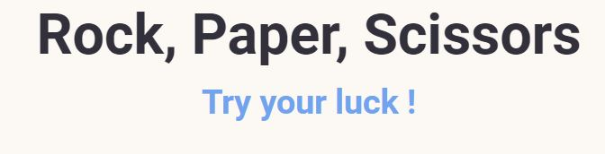
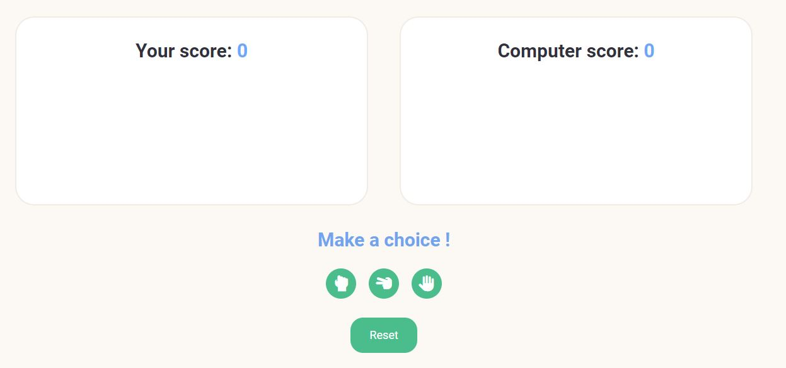
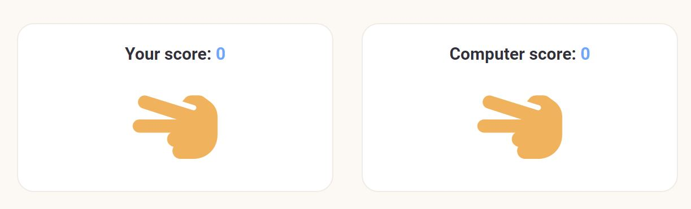

Rock, Paper, Scissors Game!

This website allows a user to play the game rock, paper, scissors against the computer. The game was designed to be simple and user friendly. The game keeps score of both the user and the computer while it is being played or until the reset button is selected in which case the game will be reset to a new game.

The website encourages users to play the rock, paper, scissors game by asking the user to "Try Your Luck" when they first navigate to the site. The uses icon buttons with the symbol of rock, paper or scissors in which the user can select. Each icon changes colour when the mouse is hovered over them to indicate which button the user is about to select. Once a selects a button the site will indicate whether they have won, lost or if it is a tie between the user and the computer.

Features

•	Featured at the top of the page is the Rock, Paper, Scissors heading long with the invitation for the user to try their luck at the game. 

•	The Game Area

    This section will allow the user to play the Rock, Paper, Scissor’s game. The user will be able to easily see icons for Rock, Paper and Scissors. 
    The user will be able to select the choice they would like to play by clicking on the different icons.

•	The Score Area

    This section will allow the user to see exactly how many correct and incorrect choices they have made.

  
Validator Testing
 
•	HTML
 
        No errors were returned when passing through the official W3C validator
         
•	CSS
 
        No errors were found when passing through the official (Jigsaw) validator
         
•	JavaScript
         
        No errors were found when passing through the official Jshint validator
         

Deployment
    The site was deployed to GitHub pages
    The live link can be found here - https://cormacwhite.github.io/RockPaperScissorsGame/

