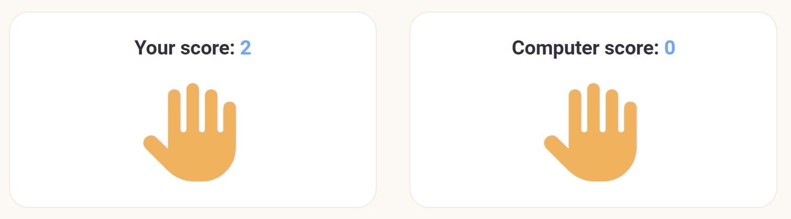

Rock, Paper, Scissors Game!

This website allows a user to play the game rock, paper, scissors against the computer. The game was desinged to be simple and user freindly. The game keeps score of both the user and the computer while it is being played or until the reset button is selected in which case the game will be reset to a new game. 

The website encourages users to play the rock, paper, scissors game by asking the user to "Try Your Luck" when they first navigate to the site. The uses icons with the simble  

